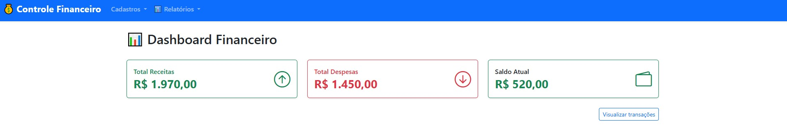
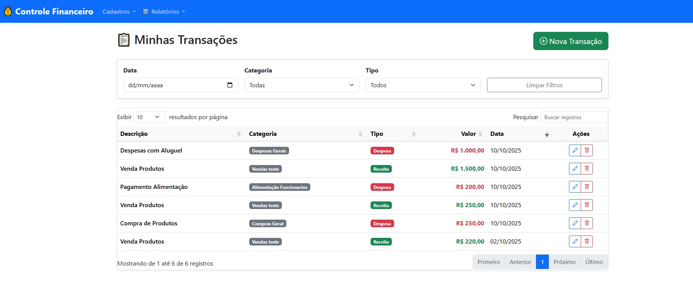
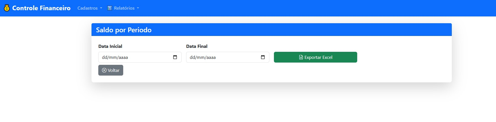
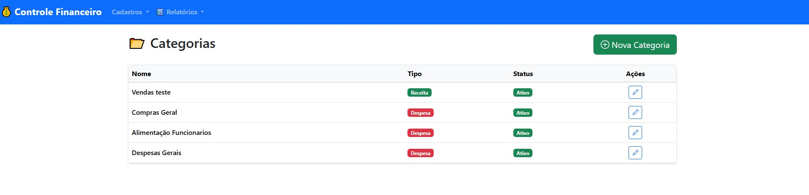
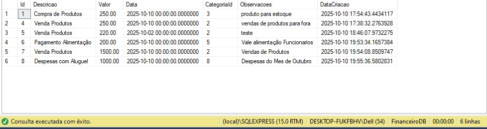
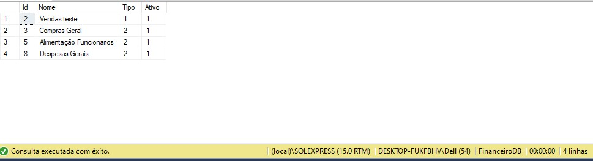

# 📊 Controle Financeiro

Sistema para controle de receitas e despesas de pequenas empresas, com
categorização de transações, dashboard financeiro e relatórios
avançados.

------------------------------------------------------------------------

## 🧰 Tecnologias Utilizadas

-   **.NET 8.0**
-   **C#**
-   **Bootstrap 5**
-   **Entity Framework Core**
-   **SQLite / SQL Server**

------------------------------------------------------------------------

## 🌟 Funcionalidades

### 📋 Cadastros

-   **Categorias**: Cadastro de categorias de receita e despesa (com
    status ativo/inativo)
-   **Transações**: Registro de receitas e despesas com data, valor,
    categoria e observações

### 📊 Relatórios

-   **Dashboard**: Visão geral com saldo, receitas e despesas
-   **Saldo por Período**: Relatório filtrável por data com exportação
    para Excel (.xlsx)

### 🔒 Validações

-   Valor da transação deve ser maior que zero\
-   Data da transação não pode ser futura\
-   Categoria deve existir e estar ativa\
-   Nome da categoria é obrigatório

### 🛠️ Outros

-   Interface responsiva com Bootstrap 5\
-   Mensagens de sucesso/erro elegantes\
-   Confirmação segura para exclusão\
-   Busca, paginação e filtros avançados (**DataTables.js**)

------------------------------------------------------------------------

## 🏗️ Arquitetura

O projeto segue os princípios de **Clean Architecture** e separação de
responsabilidades:

    ControleFinanceiro.sln
    ┣ ControleFinanceiro.Web       → Camada de apresentação (MVC)
    ┣ ControleFinanceiro.Domain    → Entidades e enums
    ┣ ControleFinanceiro.Aplicacao → Serviços, DTOs, interfaces de repositório
    ┣ ControleFinanceiro.Infra     → Implementações de repositórios, configuração do EF Core

### Padrões Utilizados

-   Repository Pattern\
-   Service Layer\
-   DTO (Data Transfer Object)\
-   Fluent API para mapeamento do Entity Framework\
-   Injeção de Dependência

------------------------------------------------------------------------

## 🚀 Como Executar

### Pré-requisitos

-   .NET 8.0 SDK\
-   SQL Server (LocalDB, Express ou Azure SQL)

### Passo a passo

#### 1️⃣ Clone o repositório

``` bash
git clone https://github.com/rbcarareto-spec/ControleFinanceiro.git
cd ControleFinanceiro
```

#### 2️⃣ Restaure os pacotes

``` bash
dotnet restore
```

#### 3️⃣ Configure a string de conexão

Edite o arquivo `ControleFinanceiro.Web/appsettings.json`:

``` json
{
  "ConnectionStrings": {
    "DefaultConnection": "Server=(localdb)\\mssqllocaldb;Database=FinanceiroDb;Trusted_Connection=true;MultipleActiveResultSets=true"
  }
}
```

#### 4️⃣ Gere e aplique as migrations

``` bash
dotnet ef database update --project ControleFinanceiro.Infra --startup-project ControleFinanceiro.Web
```

#### 5️⃣ Execute a aplicação

``` bash
dotnet run --project ControleFinanceiro.Web
```

## 📦 Pacotes Principais

  --------------------------------------------------------------------------------------------
  Pacote                                    Versão                 Descrição
  ----------------------------------------- ---------------------- ---------------------------
  Microsoft.EntityFrameworkCore.SqlServer   8.0.x                  ORM para SQL Server

  Microsoft.EntityFrameworkCore.Design      8.0.x                  Ferramentas de migração

  EPPlus                                    7.1.3                  Geração de arquivos Excel

  Bootstrap                                 5.3.3                  Framework CSS

  Bootstrap Icons                           1.11.3                 Ícones vetoriais

  DataTables                                2.0.8                  Tabelas avançadas com
                                                                   filtros
  --------------------------------------------------------------------------------------------

------------------------------------------------------------------------

## 🖼️ Telas do Sistema

### Dashboard Financeiro


### Listagem de Transações


### Relatório (Exportação Excel)


### Categorias


------------------------------------------------------------------------

## 🖼️ Banco de Dados Populado

### Tabela Transação


### Tabela Categoria


------------------------------------------------------------------------

## 📝 Licença

Este projeto é de código aberto sob a licença **MIT**.\
Veja o arquivo [LICENSE](LICENSE) para mais detalhes.

------------------------------------------------------------------------


